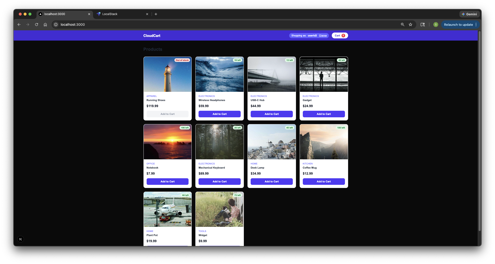
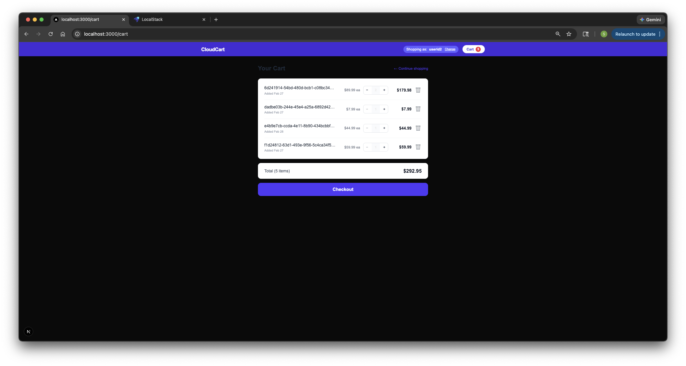
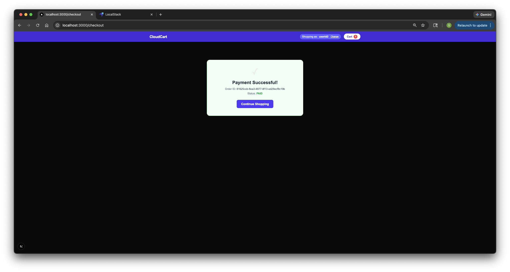

# CloudCart

A serverless e-commerce platform built with AWS Lambda, DynamoDB, SQS, and Next.js — running locally via LocalStack.

## Architecture

```
┌─────────────────────────────────────────────────────────┐
│                      Next.js Frontend                   │
│         Products → Cart → Checkout → Order Status       │
└───────────────────────────┬─────────────────────────────┘
                            │ /api-products, /api-cart, /api-orders
                ┌───────────▼───────────┐
                │   Unified API Gateway  │
                │   (UnifiedApiDev)      │
                └──┬──────────┬─────────┘
                   │          │           │
    ┌──────────────▼──┐  ┌────▼────┐  ┌──▼──────────────┐
    │  product-catalog│  │  cart   │  │  order-service   │
    │  Lambda + DDB   │  │  Lambda │  │  Lambda + DDB    │
    └─────────────────┘  │  + DDB  │  └─────────────────┘
                         └─────────┘

    ┌─────────────────────────────────────────────────┐
    │                  order-service                  │
    │  validate → idempotency check                   │
    │  → PATCH /products/{id}/stock (reserve) × N    │
    │    (rollback via release on any failure)        │
    │  → DynamoDB PENDING → OrderPlacedEvent → SQS   │
    └──────────────────────────┬──────────────────────┘
                               │ OrderPlacedQueueDev (DLQ: OrderPlacedDLQDev)
                    ┌──────────▼──────────┐
                    │   payment-service   │
                    │  80% PAID / 20% FAILED           │
                    │  → UpdateItem DynamoDB            │
                    │  If PAID → PaymentSuccessEvent   │
                    └──────────┬──────────┘
                               │ PaymentSuccessQueueDev (DLQ: PaymentSuccessDLQDev)
                    ┌──────────▼──────────┐
                    │  shipment-service   │
                    │  generate trackingId             │
                    │  → UpdateItem SHIPPED            │
                    └─────────────────────┘
```

## Services

| Service | Runtime | Trigger | Table |
|---|---|---|---|
| `cloudcart-product-catalog-java` | Java 21 Lambda | REST API | `ProductsTableDev` |
| `cloudcart-cart-service` | Java 21 Lambda | REST API | `CartTableDev` |
| `cloudcart-order-service` | Java 21 Lambda | REST API | `OrdersTableDev`, `IdempotencyTableDev` |
| `cloudcart-payment-service` | Java 21 Lambda | SQS (`OrderPlacedQueueDev`) | `OrdersTableDev` |
| `cloudcart-shipment-service` | Java 21 Lambda | SQS (`PaymentSuccessQueueDev`) | `OrdersTableDev` |
| `cloudcart-frontend` | Next.js | — | — |

## API Routes

### Product Catalog
| Method | Path | Description |
|---|---|---|
| `GET` | `/products?limit=N&lastKey=X` | List products (paginated, limit capped 1–100) |
| `POST` | `/products` | Create product |
| `GET` | `/products/{id}` | Get product |
| `PATCH` | `/products/{id}/stock` | Update stock — body: `{"stock":N}` (absolute), `{"reserve":N}` (conditional decrement, 409 if insufficient), or `{"release":N}` (increment) |

### Cart
| Method | Path | Description |
|---|---|---|
| `POST` | `/cart` | Add item to cart |
| `GET` | `/cart/{userId}` | View cart |
| `PATCH` | `/cart/{userId}/{productId}` | Update quantity |
| `DELETE` | `/cart/{userId}/{productId}` | Remove item |

### Orders
All order endpoints require `x-api-key: cloudcart-dev-key-2024`.

| Method | Path | Description |
|---|---|---|
| `POST` | `/orders` | Place order — atomic stock reservation, returns 409 if insufficient |
| `GET` | `/orders/{orderId}?userId=X` | Get order — `userId` required; returns 403 if it doesn't match the order owner (includes `trackingId` and `shippedAt` once shipped) |
| `GET` | `/orders?userId=X` | List user's orders — queries `userId-index` GSI |

`POST /orders` accepts an optional `Idempotency-Key` header — repeated requests with the same key return the cached response for 24 hours.

## Order Flow

1. Customer adds items to cart and navigates to `/checkout`
2. "Place Order" sends `POST /orders` with `x-api-key` header
   - Input is validated (userId required, quantity ≥ 1, price ≥ 0)
   - Idempotency key is checked against `IdempotencyTableDev` (24h TTL)
   - Stock is reserved via sequential `PATCH /products/{id}/stock {"reserve":N}` calls to the product catalog API; on any 409 or error, already-reserved items are released before returning the error
   - If any item is out of stock → **409** `{"error":"Insufficient stock","items":[...]}`
   - Order saved as **PENDING**, `OrderPlacedEvent` published to `OrderPlacedQueueDev`
   - Successful response is cached in `IdempotencyTableDev`
3. Payment Lambda consumes the event → **80% PAID / 20% FAILED**
   - Uses conditional `UpdateItem` (`attribute_exists(orderId) AND status = PENDING`) — idempotent on retry
   - If FAILED → releases reserved stock via `PATCH /products/{id}/stock {"release":N}` for each item
   - Failed records are reported via `ReportBatchItemFailures` — retried up to 3× before landing in `OrderPlacedDLQDev`
   - If PAID → publishes `PaymentSuccessEvent` to `PaymentSuccessQueueDev`
4. Shipment Lambda consumes the payment event → generates `TRK-XXXXXXXX` tracking ID
   - Uses conditional `UpdateItem` (`status = PAID`) — idempotent on retry; duplicate deliveries skip silently, preserving the original `trackingId`
   - Order updated to **SHIPPED** with `trackingId` and `shippedAt`
   - Failed records retry up to 3× before landing in `PaymentSuccessDLQDev`
5. Checkout page polls `GET /orders/{id}` every 2s — status progresses PENDING → PAID → SHIPPED

## Reliability Features

| Feature | Details |
|---|---|
| **Idempotency** | `POST /orders` deduplicates on `Idempotency-Key` header; results cached 24h in DynamoDB |
| **Stock reservation via API** | Order service calls `PATCH /products/{id}/stock {"reserve":N}` on the product catalog API; on failure a compensating `{"release":N}` call rolls back already-reserved items. Services own their own data — no cross-service DynamoDB access. |
| **Dead Letter Queues** | `OrderPlacedDLQDev` and `PaymentSuccessDLQDev`; messages moved after 3 failed delivery attempts |
| **Order ownership check** | `GET /orders/{orderId}` requires `?userId=X`; returns 403 if it doesn't match the order's owner |
| **GSI Query for order listing** | `GET /orders?userId=X` queries the `userId-index` GSI — O(results), not O(table) |
| **Shipment idempotency** | Shipment `UpdateItem` conditions on `status = PAID`; duplicate SQS deliveries skip silently, preserving the original `trackingId` |
| **Batch item failures** | Payment and shipment Lambdas return `batchItemFailures` so only failed records are retried |
| **API key auth** | All order endpoints require `x-api-key: cloudcart-dev-key-2024` |
| **Input validation** | 400s for blank fields, quantity < 1, negative prices, non-numeric pagination params |
| **SDK retry** | All DynamoDB/SQS clients configured with 3 retries + exponential backoff |
| **Static SDK clients** | Clients initialised once per Lambda container; reused across warm invocations |
| **Structured logging** | JSON logs to stdout with `timestamp`, `level`, `service`, `correlationId` fields |
| **CloudWatch metrics** | EMF-format metrics emitted to stdout: `OrderPlaced`, `StockInsufficient`, `PaymentSucceeded`, `PaymentFailed`, `ShipmentInitiated`, and error counters |
| **CloudWatch alarms** | `ApproximateNumberOfMessagesVisible > 0` on both DLQs |

## Screenshots

### Product Listing


### Cart


### Checkout


### Order Placed


## Prerequisites

- Docker
- Java 21 + Maven
- Node.js 20+
- LocalStack Pro (auth token required)
- `awslocal` CLI (`pip install awscli-local`)

## Getting Started

### 1. Start LocalStack

```bash
docker run -d \
  --name localstack \
  -p 4566:4566 \
  -e LOCALSTACK_AUTH_TOKEN=<your-token> \
  -v /var/run/docker.sock:/var/run/docker.sock \
  localstack/localstack-pro:latest
```

### 2. Deploy all stacks

```bash
bash deploy-localstack.sh
```

Builds all five service JARs, uploads them to S3, and deploys CloudFormation stacks in dependency order:
`cart` + `products` → `order` → `payment` → `shipment` → `gateway`

### 3. Configure the frontend

After deploy, grab the `UnifiedApiInternalUrl` from the gateway stack output and add it to `cloudcart-frontend/.env.local`:

```env
NEXT_PUBLIC_PRODUCTS_API=/api-products
NEXT_PUBLIC_CART_API=/api-cart
NEXT_PUBLIC_ORDER_API=/api-orders
NEXT_PUBLIC_UNIFIED_API_INTERNAL=http://localhost:4566/restapis/<gateway-api-id>/dev/_user_request_
```

All three frontend rewrites (`/api-products`, `/api-cart`, `/api-orders`) route through the single unified gateway — only one API ID is needed.

### 4. Start the frontend

```bash
cd cloudcart-frontend
npm install
npm run dev
```

Open **http://localhost:3000**

### 5. Seed products (optional)

Products are seeded automatically at the end of `deploy-localstack.sh`. To re-run manually:

```bash
bash seed-products.sh
```

## Force-refreshing Lambda code

CloudFormation only redeploys when the template changes. After a code-only change, force a Lambda update:

```bash
awslocal lambda update-function-code \
  --function-name <FunctionName> \
  --s3-bucket sid-mysourcecode \
  --s3-key <jar-name>
```

## Tech Stack

- **Backend**: AWS Lambda (Java 21), DynamoDB, SQS, API Gateway (REST v1)
- **Frontend**: Next.js, TypeScript, Tailwind CSS, Axios
- **Infrastructure**: AWS CloudFormation, LocalStack Pro
- **Build**: Maven (Shade plugin for fat JARs)
