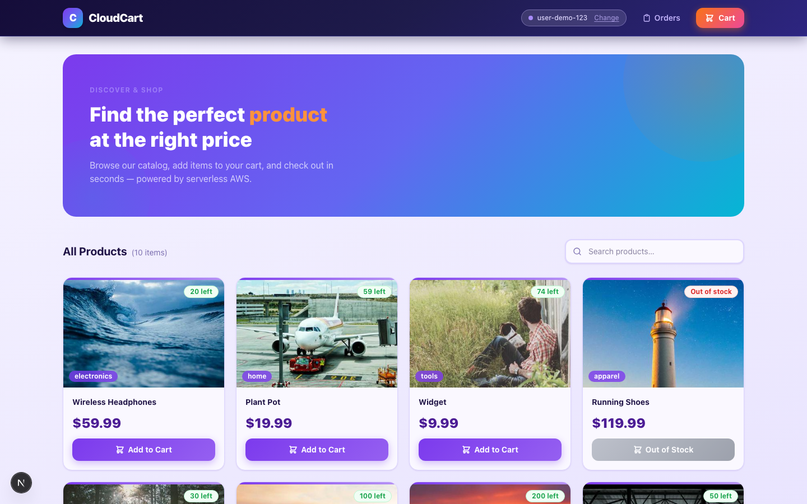
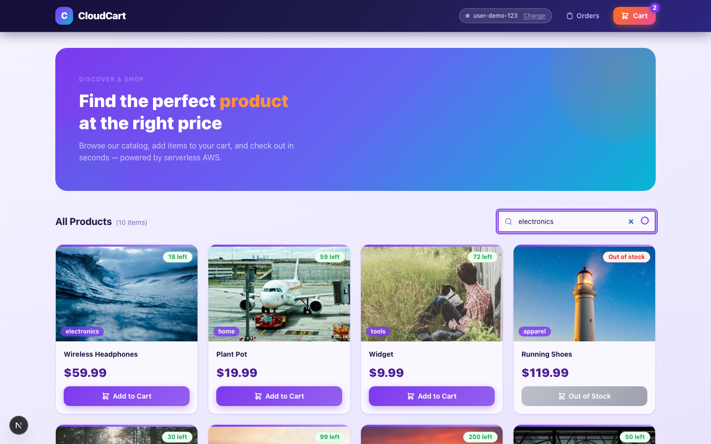
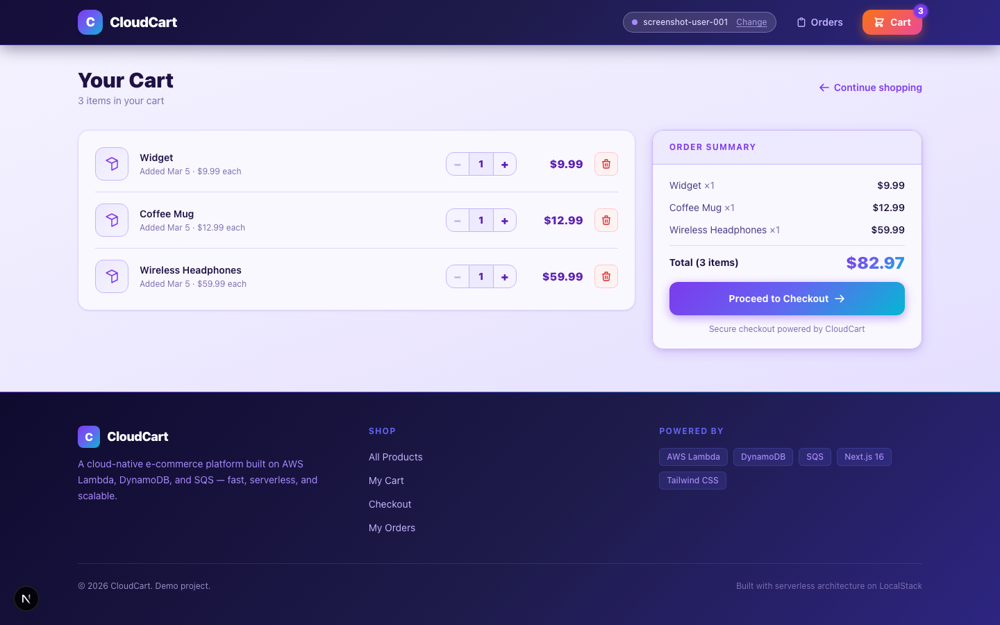
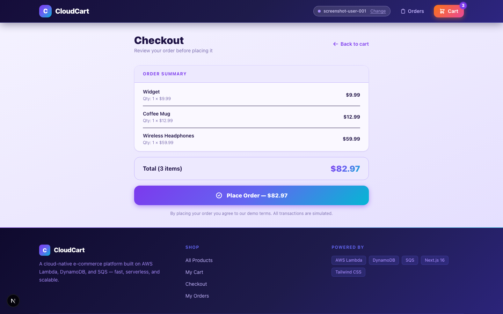
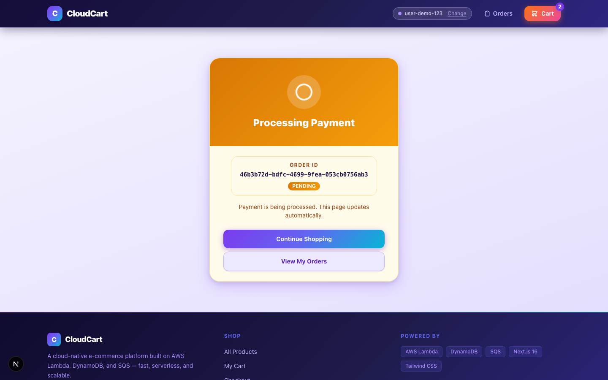
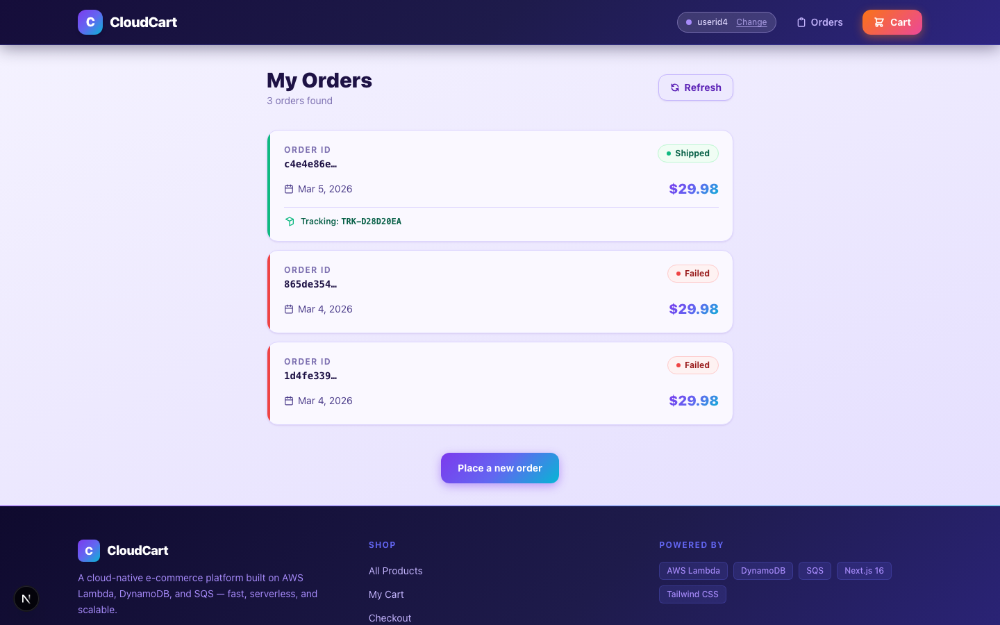

# CloudCart

A serverless e-commerce platform built with AWS Lambda, DynamoDB, SQS, Step Functions, and Next.js — running locally via LocalStack.

## Screenshots

### Product Listing


### Product Search


### Cart


### Checkout


### Order Placed


### My Orders


## Architecture

```
┌──────────────────────────────────────────────────────────────────┐
│                         Next.js Frontend                         │
│    Products + Search → Cart → Checkout → Order Status → Orders   │
└──────────────────────────────┬───────────────────────────────────┘
                               │ /api-products, /api-cart,
                               │ /api-orders,  /api-search
                   ┌───────────▼───────────┐
                   │   Unified API Gateway  │
                   │   (UnifiedApiDev)      │
                   └──┬──────┬──────┬──────┘
                      │      │      │      │
    ┌─────────────────▼─┐  ┌─▼──┐  ┌▼──────────────┐  ┌──────────────────┐
    │  product-catalog  │  │cart│  │  order-service  │  │  search-service  │
    │  Lambda + DDB     │  │ λ  │  │  Lambda + DDB   │  │  Lambda +        │
    │  (DDB Stream ──────────────────────────────────────► OpenSearch)     │
    └───────────────────┘  └────┘  └────────────────┘  └──────────────────┘
```

### Search Architecture

Product writes to `ProductsTableDev` emit DynamoDB Stream events. `StreamIndexFunctionDev` consumes the stream and keeps the OpenSearch index in sync automatically. For initial or manual reindexing, `BulkReindexFunctionDev` scans the full table and bulk-loads it into OpenSearch.

```
POST /products  ──► ProductsTableDev  ──► DynamoDB Stream
                                               │
                                     StreamIndexFunctionDev
                                               │ PUT /products/_doc/{id}
                                               ▼
                                          OpenSearch
                                        (cloudcart-search-dev)
                                               ▲
                          GET /search?q=... ───┘ (multi_match: title^2, category)
```

### Order Saga (Choreography)

```
order-service
  validate → idempotency check
  → reserve stock via PATCH /products/{id}/stock × N
  → DynamoDB PENDING
  → SagaTableDev (STARTED / STOCK_RESERVED)
  → OrderPlacedEvent → OrderPlacedQueueDev
          │ (DLQ: OrderPlacedDLQDev)
          ▼
  payment-service   80% PAID / 20% FAILED
  → UpdateItem OrdersTableDev (PENDING → PAID or FAILED)
  If PAID:
    → SagaTableDev (STARTED / PAYMENT_COMPLETED)
    → PaymentSuccessEvent → PaymentSuccessQueueDev
          │ (DLQ: PaymentSuccessDLQDev)
          ▼
    shipment-service
    → UpdateItem OrdersTableDev (PAID → SHIPMENT_CREATED)
    → SagaTableDev (COMPLETED / SHIPMENT_CREATED)

  EventBridge (rate 5 min) → OrderShippingStateMachine
    → ScanShipmentCreatedFunction
    → scans OrdersTableDev for SHIPMENT_CREATED orders
    → publishes OrderShippedEvent → OrderShippedQueueDev
          │ (DLQ: OrderShippedDLQDev)
          ▼
    ProcessOrderShippedFunction
    → UpdateItem OrdersTableDev (SHIPMENT_CREATED → SHIPPED)
    → sets trackingId (TRK-XXXXXXXX) + shippedAt
    → publishes SNS notification → OrderShippedTopicDev

  If FAILED:
    → SagaTableDev (COMPENSATING / PAYMENT_FAILED)
    → StockCompensationEvent → StockCompensationQueueDev
          │ (DLQ: StockCompensationDLQDev)
          ▼
    compensation-service (ProcessCompensationFunctionDev)
    → PATCH /products/{id}/stock {"release":N} × N
    → SagaTableDev (COMPENSATION_COMPLETED / STOCK_RELEASED)
```

## Services

| Service | Runtime | Trigger | Storage |
|---|---|---|---|
| `cloudcart-product-catalog-java` | Java 21 Lambda | REST API | `ProductsTableDev` (DDB) |
| `cloudcart-cart-service` | Java 21 Lambda | REST API | `CartTableDev` (DDB) |
| `cloudcart-order-service` | Java 21 Lambda | REST API | `OrdersTableDev`, `IdempotencyTableDev`, `SagaTableDev` |
| `cloudcart-payment-service` | Java 21 Lambda | SQS (`OrderPlacedQueueDev`) | `OrdersTableDev`, `SagaTableDev` |
| `ProcessShipmentFunctionDev` | Java 21 Lambda | SQS (`PaymentSuccessQueueDev`) | `OrdersTableDev`, `SagaTableDev` |
| `ScanShipmentCreatedFunctionDev` | Java 21 Lambda | Step Functions (EventBridge schedule) | `OrdersTableDev` |
| `ProcessOrderShippedFunctionDev` | Java 21 Lambda | SQS (`OrderShippedQueueDev`) | `OrdersTableDev`, SNS |
| `ProcessCompensationFunctionDev` | Java 21 Lambda | SQS (`StockCompensationQueueDev`) | `SagaTableDev` |
| `cloudcart-search-service` | Java 21 Lambda | DDB Stream + REST API | OpenSearch (`cloudcart-search-dev`) |
| `cloudcart-frontend` | Next.js | — | — |

## API Routes

### Product Search
| Method | Path | Description |
|---|---|---|
| `GET` | `/search?q=<term>&limit=N` | Full-text search across `title` (boosted 2×) and `category`; `limit` 1–100, default 20 |
| `POST` | `/search/reindex` | Bulk-reindex all products from DynamoDB into OpenSearch — useful after a fresh deploy |

Search uses OpenSearch `multi_match` with the standard analyzer. Whole-word token matching: `headphones` matches "Wireless Headphones"; `phone` does not (use the full word).

### Orders Page

Customers can view all their past orders at `/orders`. The page lists each order with its status badge, total amount, date, and — once shipped — the tracking number. A "My Orders" link in the header provides quick navigation.

### Product Catalog
| Method | Path | Description |
|---|---|---|
| `GET` | `/products?limit=N&lastKey=X` | List products (paginated, limit capped 1–100) |
| `POST` | `/products` | Create product |
| `GET` | `/products/{id}` | Get product |
| `PATCH` | `/products/{id}/stock` | Update stock — body: `{"stock":N}` (absolute), `{"reserve":N}` (conditional decrement, 409 if insufficient), or `{"release":N}` (increment) |

### Cart
| Method | Path | Description |
|---|---|---|
| `POST` | `/cart` | Add item to cart |
| `GET` | `/cart/{userId}` | View cart |
| `PATCH` | `/cart/{userId}/{productId}` | Update quantity |
| `DELETE` | `/cart/{userId}/{productId}` | Remove item |

### Orders
All order endpoints require `x-api-key: cloudcart-dev-key-2024`.

| Method | Path | Description |
|---|---|---|
| `POST` | `/orders` | Place order — atomic stock reservation, returns 409 if insufficient |
| `GET` | `/orders/{orderId}?userId=X` | Get order — `userId` required; returns 403 if it doesn't match the order owner |
| `GET` | `/orders?userId=X` | List user's orders — queries `userId-index` GSI |

`POST /orders` accepts an optional `Idempotency-Key` header — repeated requests with the same key return the cached response for 24 hours.

## Order Flow

1. Customer adds items to cart and navigates to `/checkout`
2. "Place Order" sends `POST /orders` with `x-api-key` header
   - Input is validated (userId required, quantity ≥ 1, price ≥ 0)
   - Idempotency key is checked against `IdempotencyTableDev` (24h TTL)
   - Stock is reserved via sequential `PATCH /products/{id}/stock {"reserve":N}` calls; on any 409 or error, already-reserved items are released before returning the error
   - If any item is out of stock → **409** `{"error":"Insufficient stock","items":[...]}`
   - Order saved as **PENDING**, saga record created in `SagaTableDev` (`STARTED / STOCK_RESERVED`), `OrderPlacedEvent` published to `OrderPlacedQueueDev`
3. Payment Lambda consumes the event → **80% PAID / 20% FAILED**
   - Uses conditional `UpdateItem` (`attribute_exists(orderId) AND status = PENDING`) — idempotent on retry
   - **If PAID** → saga updated (`STARTED / PAYMENT_COMPLETED`), `PaymentSuccessEvent` published to `PaymentSuccessQueueDev`
   - **If FAILED** → saga updated (`COMPENSATING / PAYMENT_FAILED`), `StockCompensationEvent` published to `StockCompensationQueueDev` for reliable async stock release
   - Failed records reported via `ReportBatchItemFailures` — retried up to 3× before landing in `OrderPlacedDLQDev`
4. Shipment Lambda consumes the payment event
   - Conditional `UpdateItem` (`status = PAID → SHIPMENT_CREATED`) — idempotent on retry
   - Saga updated to `COMPLETED / SHIPMENT_CREATED`
   - Failed records retry up to 3× before landing in `PaymentSuccessDLQDev`
5. EventBridge rule fires every 5 minutes → starts `OrderShippingStateMachineDev`
   - `ScanShipmentCreatedFunctionDev` scans `OrdersTableDev` for `SHIPMENT_CREATED` orders
   - Publishes one `OrderShippedEvent` per order to `OrderShippedQueueDev`
   - `ProcessOrderShippedFunctionDev` consumes each event (batch size 5)
   - Conditional `UpdateItem` (`status = SHIPMENT_CREATED → SHIPPED`) — idempotent on retry
   - Generates `trackingId` (`TRK-XXXXXXXX`) and records `shippedAt` timestamp
   - Publishes a shipping notification to `OrderShippedTopicDev` (SNS) with `orderId`, `userId`, and `trackingId` — non-fatal if SNS publish fails (order is already SHIPPED in DynamoDB)
   - Failed records retry up to 3× before landing in `OrderShippedDLQDev`
6. Compensation Lambda consumes `StockCompensationEvent` (batch size 1)
   - Calls `PATCH /products/{id}/stock {"release":N}` for each item sequentially
   - On any HTTP failure → message returned to `StockCompensationQueueDev` for retry (up to 3×, then `StockCompensationDLQDev`)
   - On full success → saga updated to `COMPENSATION_COMPLETED / STOCK_RELEASED`
7. Checkout page polls `GET /orders/{id}` every 2s — status progresses PENDING → PAID → SHIPMENT_CREATED; once `SHIPMENT_CREATED` the page shows "Shipment Created" and stops polling. The order advances to `SHIPPED` asynchronously via the scheduler (visible on the `/orders` page).

## Saga State Machine

```
PlaceOrderHandler          → STARTED      / STOCK_RESERVED
ProcessPaymentHandler      → STARTED      / PAYMENT_COMPLETED   (PAID path)
                           → COMPENSATING / PAYMENT_FAILED      (FAILED path)
ProcessShipmentHandler     → COMPLETED    / SHIPMENT_CREATED
ProcessCompensationHandler → COMPENSATION_COMPLETED / STOCK_RELEASED
                             (or stays COMPENSATING → DLQ after 3 retries)
```

Order status lifecycle:
```
PENDING → PAID → SHIPMENT_CREATED → SHIPPED
                                    (set by ProcessOrderShippedFunction with trackingId)
PENDING → FAILED
          (stock released via StockCompensationQueue)
```

`SagaTableDev` records carry a 7-day TTL (`expiresAt`) and are keyed by `orderId`. All saga updates use conditional writes (`sagaStatus = :expected`) so concurrent retries are idempotent.

## Reliability Features

| Feature | Details |
|---|---|
| **Choreography Saga** | Full saga state machine in `SagaTableDev`; each service writes its own step; no orchestrator |
| **SQS-based compensation** | Payment failure publishes to `StockCompensationQueueDev` instead of a fire-and-forget HTTP call; the compensation Lambda retries up to 3× with DLQ fallback |
| **Idempotency** | `POST /orders` deduplicates on `Idempotency-Key` header; results cached 24h in DynamoDB |
| **Stock reservation** | `PATCH /products/{id}/stock {"reserve":N}` — conditional decrement; on order-placement failure, already-reserved items are released synchronously |
| **Dead Letter Queues** | `OrderPlacedDLQDev`, `PaymentSuccessDLQDev`, `StockCompensationDLQDev`, `OrderShippedDLQDev` — messages moved after 3 failed delivery attempts |
| **CloudWatch alarms** | `ApproximateNumberOfMessagesVisible > 0` on all four DLQs |
| **Scheduled shipping** | EventBridge rule (`rate(5 minutes)`) → Step Functions → `ScanShipmentCreatedFunctionDev` scans for `SHIPMENT_CREATED` orders and fans out to `OrderShippedQueueDev` |
| **Conditional DynamoDB writes** | All status transitions use condition expressions; stale retries skip silently |
| **Order ownership check** | `GET /orders/{orderId}` requires `?userId=X`; returns 403 if mismatched |
| **GSI query for order listing** | `GET /orders?userId=X` queries `userId-index` GSI — O(results), not O(table) |
| **Batch item failures** | Payment, shipment, and compensation Lambdas return `batchItemFailures` so only failed records are retried |
| **SNS shipping notifications** | `ProcessOrderShippedFunctionDev` publishes to `OrderShippedTopicDev` after each successful SHIPPED transition — payload: `{orderId, userId, trackingId}`; SNS publish failure is non-fatal (logged, does not trigger retry) |
| **API key auth** | All order endpoints require `x-api-key: cloudcart-dev-key-2024` |
| **Input validation** | 400s for blank fields, quantity < 1, negative prices, non-numeric pagination params |
| **SDK retry** | All DynamoDB/SQS clients configured with 3 retries + exponential backoff |
| **Static SDK clients** | Clients initialised once per Lambda container; reused across warm invocations |
| **Structured logging** | JSON logs to stdout with `timestamp`, `level`, `service`, `correlationId` fields |
| **CloudWatch metrics** | EMF-format metrics: `OrderPlaced`, `StockInsufficient`, `PaymentSucceeded`, `PaymentFailed`, `ShipmentInitiated`, `OrderShipped`, `CompensationCompleted`, `SagaUpdateFailed`, and error counters |
| **Orders page** | `/orders` frontend page — lists all orders for a user with status badges, totals, dates, and tracking numbers once shipped |

## Frontend Options

Two frontend implementations are available — both connect to the same backend via the unified API Gateway.

| | Next.js (`cloudcart-frontend/`) | Angular (`cloudcart-angular/`) |
|---|---|---|
| Framework | Next.js 16 + React 19 | Angular 16 |
| Styling | Tailwind CSS 4 | Tailwind CSS |
| HTTP | Axios | Angular HttpClient |
| Port | 3000 | 4200 |
| Routing | Next.js file-based | Angular Router (lazy-loaded) |
| Pages | Products, Cart, Checkout, Orders | Products, Cart, Checkout, Orders |

### Running the Next.js frontend

```bash
cd cloudcart-frontend
npm install
npm run dev        # http://localhost:3000
```

### Running the Angular frontend

```bash
cd cloudcart-angular
npm install
```

Update `proxy.conf.json` with your unified API Gateway ID (from `terraform output unified_api_internal_url` or the CloudFormation gateway stack output):

```json
{
  "/api-products": { "target": "http://localhost:4566/restapis/<gateway-id>/dev/_user_request_", ... },
  "/api-cart":     { "target": "http://localhost:4566/restapis/<gateway-id>/dev/_user_request_", ... },
  "/api-orders":   { "target": "http://localhost:4566/restapis/<gateway-id>/dev/_user_request_", ... },
  "/api-search":   { "target": "http://localhost:4566/restapis/<gateway-id>/dev/_user_request_", ... }
}
```

Then start the dev server:

```bash
npm start          # http://localhost:4200
```

The Angular app uses the same four proxy paths (`/api-products`, `/api-cart`, `/api-orders`, `/api-search`) as the Next.js frontend — only the gateway ID in `proxy.conf.json` needs updating between deployments.

## Prerequisites

- Docker
- Java 21 + Maven
- Node.js 20+
- LocalStack Pro (auth token required)
- `awslocal` CLI (`pip install awscli-local`)

## Getting Started

### 1. Start LocalStack

```bash
docker run -d \
  --name localstack \
  -p 4566:4566 \
  -e LOCALSTACK_AUTH_TOKEN=<your-token> \
  -v /var/run/docker.sock:/var/run/docker.sock \
  localstack/localstack-pro:latest
```

### 2. Deploy all stacks

Two equivalent deployment paths are available — pick one.

#### Option A: Terraform (recommended)

```bash
# Build JARs and upload to S3 (required before first apply)
mvn -f cloudcart-cart-service/pom.xml package -q -DskipTests
mvn -f cloudcart-product-catalog-java/pom.xml package -q -DskipTests
mvn -f cloudcart-order-service/pom.xml package -q -DskipTests
mvn -f cloudcart-payment-service/pom.xml package -q -DskipTests
mvn -f cloudcart-shipment-service/pom.xml package -q -DskipTests
mvn -f cloudcart-search-service/pom.xml package -q -DskipTests

awslocal s3 mb s3://sid-mysourcecode
awslocal s3 cp cloudcart-cart-service/target/cart-service-1.0.0.jar         s3://sid-mysourcecode/
awslocal s3 cp cloudcart-product-catalog-java/target/product-catalog-1.0.0.jar s3://sid-mysourcecode/
awslocal s3 cp cloudcart-order-service/target/order-service-1.0.0.jar       s3://sid-mysourcecode/
awslocal s3 cp cloudcart-payment-service/target/payment-service-1.0.0.jar   s3://sid-mysourcecode/
awslocal s3 cp cloudcart-shipment-service/target/shipment-service-1.0.0.jar s3://sid-mysourcecode/
awslocal s3 cp cloudcart-search-service/target/search-service-1.0.0.jar     s3://sid-mysourcecode/

# Deploy all 7 modules (~191 resources)
cd terraform
terraform init
terraform apply -auto-approve
```

After apply, Terraform prints the unified gateway URL:
```
unified_api_internal_url = "http://localhost:4566/restapis/<id>/dev/_user_request_"
```
Use this value in step 3.

To update Lambda code after a code-only change:
```bash
# Rebuild the JAR, re-upload, then re-apply
mvn -f cloudcart-cart-service/pom.xml package -q -DskipTests
awslocal s3 cp cloudcart-cart-service/target/cart-service-1.0.0.jar s3://sid-mysourcecode/
cd terraform && terraform apply -auto-approve
```

#### Option B: CloudFormation (original)

```bash
bash deploy-localstack.sh
```

Builds all six JARs, uploads them to S3, and deploys CloudFormation stacks in dependency order:
`cart` + `products` → `order` → `payment` → `shipment` → `search` → `gateway`

The script also enables DynamoDB Streams on `ProductsTableDev` (required for real-time search indexing) and passes the stream ARN to the search stack as a parameter, working around a LocalStack limitation where `!GetAtt Table.StreamArn` returns `"unknown"` in CloudFormation.

### 3. Configure the frontend

After deploy, grab the `UnifiedApiInternalUrl` from the gateway stack output and add it to `cloudcart-frontend/.env.local`:

```env
NEXT_PUBLIC_PRODUCTS_API=/api-products
NEXT_PUBLIC_CART_API=/api-cart
NEXT_PUBLIC_ORDER_API=/api-orders
NEXT_PUBLIC_SEARCH_API=/api-search
NEXT_PUBLIC_UNIFIED_API_INTERNAL=http://localhost:4566/restapis/<gateway-api-id>/dev/_user_request_
```

All four frontend rewrites (`/api-products`, `/api-cart`, `/api-orders`, `/api-search`) route through the single unified gateway — only one API ID is needed.

### 4. Seed the search index

After deploying and seeding products, bulk-load them into OpenSearch:

```bash
curl -X POST "http://localhost:4566/restapis/<gateway-api-id>/dev/_user_request_/search/reindex"
# {"indexed":10}
```

The search index stays in sync automatically via the DynamoDB Stream → `StreamIndexFunctionDev` after this initial load.

### 5. Start the frontend

```bash
cd cloudcart-frontend
npm install
npm run dev
```

Open **http://localhost:3000**

### 6. Seed products (optional)

Products are seeded automatically at the end of `deploy-localstack.sh`. To re-run manually:

```bash
bash seed-products.sh
```

## Force-refreshing Lambda code

**Terraform**: rebuild the JAR, re-upload to S3, then `terraform apply` — the `source_code_hash` triggers a Lambda update automatically.

**CloudFormation**: only redeploys when the template changes. After a code-only change, force a Lambda update directly:

```bash
awslocal lambda update-function-code \
  --function-name <FunctionName> \
  --s3-bucket sid-mysourcecode \
  --s3-key <jar-name>
```

## Verifying the Saga

```bash
# Scan saga state for all orders
awslocal dynamodb scan --table-name SagaTableDev --output table

# Check all DLQ alarms
awslocal cloudwatch describe-alarms \
  --alarm-names \
    cloudcart-OrderPlacedDLQ-MessagesVisible \
    cloudcart-PaymentSuccessDLQ-MessagesVisible \
    cloudcart-StockCompensationDLQ-MessagesVisible \
    cloudcart-OrderShippedDLQ-MessagesVisible
```

## Triggering the Scheduled Shipping Flow

The EventBridge rule fires every 5 minutes automatically. To trigger it manually for testing:

```bash
# Find the state machine ARN
awslocal stepfunctions list-state-machines

# Manually start an execution
awslocal stepfunctions start-execution \
  --state-machine-arn arn:aws:states:us-east-1:000000000000:stateMachine:OrderShippingStateMachineDev \
  --input '{}'

# Check a specific order for SHIPPED status + tracking number
awslocal dynamodb get-item \
  --table-name OrdersTableDev \
  --key '{"orderId": {"S": "<your-order-id>"}}' \
  --output table
```

After execution, orders that were in `SHIPMENT_CREATED` will advance to `SHIPPED` with a `trackingId` (e.g. `TRK-A3F2B8C1`) and a `shippedAt` timestamp. The `/orders` page will reflect the updated status.

### Verifying SNS shipping notifications

Each SHIPPED transition publishes a notification to `OrderShippedTopicDev`. To capture notifications in a test queue:

```bash
# Create a test queue and subscribe it to the SNS topic
awslocal sqs create-queue --queue-name SNSTestQueueDev
awslocal sns subscribe \
  --topic-arn arn:aws:sns:us-east-1:000000000000:OrderShippedTopicDev \
  --protocol sqs \
  --notification-endpoint arn:aws:sqs:us-east-1:000000000000:SNSTestQueueDev

# Trigger the shipping flow, then poll for the notification
awslocal sqs receive-message \
  --queue-url http://sqs.us-east-1.localhost.localstack.cloud:4566/000000000000/SNSTestQueueDev \
  --wait-time-seconds 5
```

Each message body contains:
```json
{
  "Subject": "Your CloudCart order has shipped!",
  "TopicArn": "arn:aws:sns:us-east-1:000000000000:OrderShippedTopicDev",
  "Message": "{\"orderId\":\"...\",\"userId\":\"...\",\"trackingId\":\"TRK-XXXXXXXX\"}"
}
```

Attach email, Lambda, or additional SQS subscribers to `OrderShippedTopicDev` via the AWS console or CloudFormation to fan out notifications to real consumers.

## Tech Stack

- **Backend**: AWS Lambda (Java 21), DynamoDB, DynamoDB Streams, SQS, SNS, OpenSearch, API Gateway (REST v1)
- **Frontend (Next.js)**: Next.js 16, React 19, TypeScript, Tailwind CSS 4, Axios
- **Frontend (Angular)**: Angular 16, TypeScript, Tailwind CSS, Angular HttpClient
- **Infrastructure**: AWS CloudFormation, Terraform (HCL), LocalStack Pro
- **Build**: Maven (Shade plugin for fat JARs)
